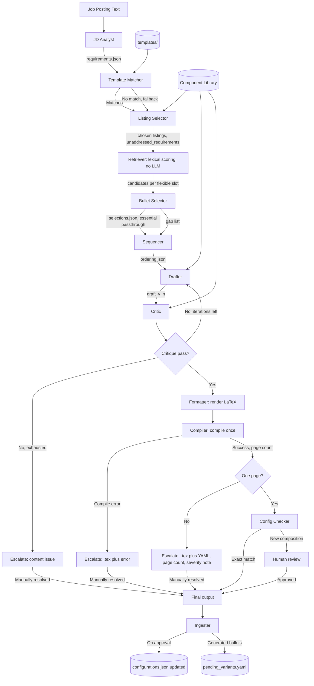

# PRD: Suit-Up - Resume Tailoring Agent

## 1. Motivation

Tailoring a resume per job posting today means manually rereading the posting, deciding which pre-written bullet variants fit best, rewriting by hand when nothing fits, and keeping the result to one page. This is slow and inconsistent, and repeated LLM calls over the full resume text are expensive and produce different phrasing each time.

Suit-Up automates this using a personal library of pre-approved resume components, starting from an already-decent tailored resume where one exists, reusing content wherever it fits, and generating new content only for real gaps.

## 2. Problem statement

1. High token cost and latency from re-generating content on every run instead of reusing vetted variants.
2. Knowledge loss: good bullet phrasings, including ones written for a past posting, get discarded instead of stored and reused.
3. Weak ATS alignment from naive LLM rewriting that does not target exact posting keywords.
4. Ordering and coherence of the assembled draft are holistic judgments a scoring function cannot make well.
5. Greedy keyword-driven selection can drop bullets that are structurally necessary but score poorly on keywords.
6. There are more listings in the library than fit on one page, and nothing decides which ones to include.
7. The output must compile to exactly one page, and overflow can mean two different problems: wording is slightly long, or too much content was selected in the first place. These need different handling.

## 3. Goals

- Reuse pre-approved content by default; generate only for confirmed gaps.
- Target exact-phrase keyword overlap without letting keyword optimization override narrative necessity.
- Select which listings appear, not just which bullets within a listing, starting from an existing tailored resume as a prior rather than the full library cold.
- Guarantee the final PDF is one page, verified by actual compilation.
- Require human review before any new listing composition is trusted, except when it exactly matches one already reviewed.
- Feed new, useful content back into the library after approval.
- Keep the MVP simple where a simple version is honest about its limits: no automated length-fixing loop, just a clean escalation when it does not fit.

## 4. Non-goals

- Multi-user support or a hosted service.
- Real-time or API-triggered execution.
- Semantic or vector search.
- Auto-approving generated content or new listing compositions without review.
- Automated content-condensing on overflow in MVP. Overflow goes to the user, not to another LLM loop.
- Proactive length estimation before compiling, in MVP. The compiler is the only source of truth on page count.

## 5. Scope

**In scope:** job posting ingestion, requirement extraction, template matching, listing selection, bullet-level variant selection, ordering, draft generation, coherence review, LaTeX compilation and page-count check, structured output, post-run library ingestion.

**Out of scope:** template rendering engine internals beyond LaTeX compile and page-count check, PDF design/styling, multi-user auth, hosted API, vector infrastructure, automated overflow correction.

## 6. Core models

### 6.1 Bullet model: essential vs flexible

Every bullet has a `role`.

- **essential**: sets scope, team size, timeframe, or headline context. Never dropped or swapped by keyword score, only lightly polished for tense or flow.
- **flexible**: emphasis can vary by audience. Carries one or more variants, each tagged with keywords. Only flexible bullets are swapped by the Bullet Selector, and only flexible bullets can be omitted if a listing needs to be shorter.

### 6.2 Listing selection, starting from a template

- A small set of user-authored broad template resumes exists, each a full, previously-good listing set for a career direction (for example ML/CV-leaning, systems-leaning, robotics-leaning).
- A **Template Matcher** picks the closest template by lexical overlap between the posting's requirements and each template's aggregate tags, or signals no good match.
- A **Listing Selector** starts from the matched template's listing set and decides deltas only: keep, drop, add, or swap a listing, using a simple count-based heuristic in MVP (a fixed max number of experience and project entries) rather than character-length estimation. It overrides a template listing only when an alternative scores clearly higher, not marginally higher. If no template matched, it ranks the full library instead.
- If a high-weight requirement has no candidate listing at all, not just no ideal bullet, the Listing Selector records it as `unaddressed_requirement` rather than inventing a new listing. Listings are never generated from nothing; only flexible bullets within an existing listing are.
- Ties between listings within a small score margin default to preferring the more recent listing.

### 6.3 Approval and storage granularity

- The library stores atomic bullet variants once, under their parent listing.
- A separate, lightweight `configurations.json` records `(listing_id, chosen variant_ids in order) -> approved: true/false, reviewed_at`.
- An exact match to a previously approved composition skips review. A new composition, even built from individually pre-approved bullets, is marked `needs_review` once, since combination effects (redundancy, tonal clash) are not guaranteed safe just because the parts are. Once reviewed, it is cached and reused freely.

### 6.4 Length handling in MVP

No proactive estimation, no automated condensing. The pipeline drafts and compiles once. The Compiler is the only ground truth on page count.

- Compile succeeds, one page: proceed.
- Compile succeeds, more than one page: stop, do not attempt automatic trimming, hand the `.tex` file and the structured draft YAML to the user directly. Attach the actual page count and a simple, non-automated severity note: just over one page suggests wording is slightly long, meaningfully over suggests too many listings or bullets were selected and the Listing Selector's choices are worth revisiting before rerunning. This note is informational only, computed from the page count, not from another LLM call.
- Compile fails outright (LaTeX error): stop, hand the `.tex` file and the error to the user. This is a different failure mode than overflow and should be visibly distinguished in the escalation.

Automated condensing is a plausible post-MVP addition once there is real data on how often and by how much runs overflow, not before.

## 7. Functional requirements

- FR1: Accept plain text job posting as input.
- FR2: Extract weighted requirements and exact-phrase keywords.
- FR3: Match the posting to the closest broad template, or fall back to full-library ranking.
- FR4: Select which listings to include using a simple count cap, starting from the matched template and changing only deltas; record any high-weight requirement with no candidate listing.
- FR5: Score flexible bullet variants against requirements, lexical only, no LLM call; essential bullets excluded from scoring, always included.
- FR6: Select best variant per flexible slot within included listings; flag slots with no adequate match as gaps.
- FR7: Determine listing and bullet order as one holistic pass; essential bullets keep fixed position.
- FR8: For a flagged gap, first attempt to recombine phrasing already present across that slot's existing approved variants (synthesis) before writing content not grounded in any of them (novel generation). Tag output `generation_mode: synthesis` or `generation_mode: novel` accordingly. Never replace an essential bullet, never invent a new listing.
- FR9: Review the assembled draft for keyword coverage, groundedness, repetition and redundant emphasis across listings (not just within one), and ordering compliance; separately note if overall requirement coverage is low, as a warning, not a blocking failure.
- FR10: Render the draft to LaTeX and compile to PDF. If more than one page, or if compilation fails, stop and hand the `.tex` and draft YAML to the user with a page count or error and a severity note; no automated retry.
- FR11: On successful one-page compile, check the final composition against the configuration cache; if not an exact match to an approved entry, mark `needs_review` before treating the output as final.
- FR12: Output structured YAML distinguishing `essential`, `selected`, and `generated` bullets, plus review status, page count, and any unaddressed requirements.
- FR13: After a reviewed run, archive the output, update the configuration cache if approved, and propose generated bullets as pending variant candidates.

## 8. Non-functional requirements

- Cost: small, fixed number of LLM calls per run. Route narrow, structured tasks (Critic's rubric check, keyword tagging, template matching) to a local model via Ollama where quality allows; reserve a stronger hosted model for drafting and nuanced selection.
- Latency: a full run, including one compile, should complete well under a minute of combined LLM and compile time.
- Auditability: every scoring, selection, and length decision should be inspectable outside the LLM.
- Maintainability: library stays human-editable, git-versioned YAML, no database required for MVP.

## 9. System design

### 9.1 Storage

- Component library: one YAML file per listing.
- `index.json`: flattened cache for fast scoring, rebuilt on file change.
- `templates/`: a handful of YAML files, each a named broad resume referencing listing ids and default variant ids.
- `configurations.json`: the approval cache from 6.3.
- `pending_variants.yaml`: generated bullets awaiting review.
- Per-run archive: dated output file, kept regardless of approval or compile outcome.

### 9.2 Retrieval and scoring

Plain code. Weighted keyword overlap for flexible bullet variants against posting requirements. No vector search, no length estimation in MVP.

### 9.3 Agents

| Agent | Role | Type | Input | Output |
|---|---|---|---|---|
| JD Analyst | Extract weighted requirements and exact keywords | LLM | job posting text | requirements.json |
| Template Matcher | Pick closest broad template, or signal fallback | LLM small or Ollama | requirements.json, templates | matched template or none |
| Listing Selector | Choose listing set via count-cap heuristic, starting from template defaults; record unaddressed requirements | LLM, small context | requirements.json, template, library index | listing set, unaddressed_requirements |
| Retriever | Score flexible bullet variants | Code, no LLM | requirements.json, chosen listings | candidates per flexible slot |
| Bullet Selector | Pick variant per flexible slot, flag gaps | LLM, small context | candidates, requirements | selections.json, gap list |
| Sequencer | Decide listing and bullet order, essential positions fixed | LLM, listwise | selections, requirements | ordering.json |
| Drafter | Coherence pass on selected content; for gaps, tries synthesis from existing slot variants first, novel generation only if that is not enough | LLM | selections, ordering, gaps, source variants | draft_v(n), generation_mode per generated bullet |
| Critic | Evaluate coverage, groundedness, repetition and redundancy across listings, ordering compliance; flag low overall coverage as a warning | LLM or Ollama, separate persona from Drafter | draft_v(n), rubric, source variants | critique.json |
| Supervisor | Route on critique; on compile result route to Config Checker or straight to escalation, no compile retry loop | Control logic, not an LLM call | critique.json, compile result, iteration count | routing decision |
| Formatter | Assemble approved draft, render LaTeX | Code, no LLM | approved draft | .tex file |
| Compiler | Compile LaTeX once, check page count | Code, no LLM | .tex file | PDF, page count, or compile error |
| Config Checker | Compare final composition against configuration cache | Code, no LLM | final composition, configurations.json | approved, or needs_review |
| Ingester | Archive run, update cache on approval, propose new generated bullets as pending | Code plus light LLM/Ollama tagging pass | approved draft, requirements.json | archived run, configurations.json update, pending_variants.yaml |

Drafter and Critic use different prompts, and where cost allows different models, so the Critic evaluates blind to the Drafter's reasoning.

### 9.4 Iteration control

- Drafter/Critic: max 3 rounds, critique severity must strictly improve each round or halt and escalate.
- Compiler: single pass, no loop. Any failure, overflow or compile error, escalates directly to the user with the raw `.tex` and YAML.

## 10. Tooling and infrastructure

- **Orchestration:** LangGraph, run locally. Handles the Drafter/Critic cycle; the compile step is a simple linear branch, not a cycle, in MVP.
- **Model calls:** hosted (Bedrock or Anthropic API) for Drafter, Bullet Selector, Listing Selector, Sequencer, where writing and nuanced judgment matter; local via Ollama for Critic, Template Matcher, and Ingester's tagging, where the task is narrow and structured.
- **LaTeX compile:** local `pdflatex`/`xelatex` plus a page-count check via `pdfinfo`. No cloud service.
- **Storage:** local filesystem plus git.
- **Not used at this stage:** vector database, Step Functions, Lambda, EventBridge, DynamoDB, CloudWatch, LangSmith.

## 11. Output format

Structured YAML per listing, each bullet marked `source: essential`, `selected`, or `generated`, matched keywords per bullet, plus top-level `review_status`, `page_count`, `unaddressed_requirements`, and `low_coverage_warning` if applicable.

## 12. Example library entry

Fictional, so this document carries no personal resume content. The shape is what matters.

```yaml
id: backend_intern
type: experience
title: "Software Engineering Intern"
context:
  org: "Example Systems Inc."
  dates: "Jun. 2026 - Sept. 2026"
tags: [backend, distributed-systems, performance, testing]

bullets:
  - slot: 1
    role: essential
    text: >
      Built and shipped features across a Python service handling 40M daily
      API requests.

  - slot: 2
    role: flexible
    variants:
      - variant_id: v1_latency
        keywords: [caching, p99 latency, performance, profiling]
        text: >
          Cut p99 endpoint latency 45% (820ms to 450ms) by introducing a
          read-through cache and removing three redundant database round
          trips per request.
      - variant_id: v2_throughput
        keywords: [throughput, scalability, load testing, concurrency]
        text: >
          Doubled sustained write throughput by batching inserts behind a
          bounded queue, verified under load testing at 3x peak production
          traffic.

  - slot: 3
    role: flexible
    variants:
      - variant_id: v1_testing
        keywords: [testing, CI/CD, code coverage, regression]
        text: >
          Raised service test coverage from 34% to 81% and wired the suite
          into CI, catching two regressions before release in the first month.

metadata:
  approved: true
  last_used: null
  last_reviewed: "2026-08-03"
```

`configurations.json` entry once this exact composition has been reviewed:

```json
{
  "backend_intern|slot1:essential|slot2:v1_latency|slot3:v1_testing": {
    "approved": true,
    "reviewed_at": "2026-08-03"
  }
}
```

## 13. Edge cases

- **Posting is a poor topical fit for the whole library** (for example a non-engineering role): every listing scores low. The Critic's low-coverage warning surfaces this instead of silently producing a weak resume that looks complete.
- **No template matches well:** Listing Selector falls back to ranking the full library; expect more `needs_review` compositions on this path since it rarely reuses an approved combination.
- **High-weight requirement with no related listing at all:** recorded as `unaddressed_requirement`, never papered over by inventing a whole new listing from nothing.
- **Tied listings for one slot:** default tie-break is more recent; both are close enough in score that either would be reasonable, so this is a low-stakes default, not a hard rule.
- **Essential bullets alone exceed one page** even with zero flexible bullets included: not detected pre-draft in MVP since there is no estimator; this surfaces as a Compiler overflow with a "meaningfully over" severity note, which is the correct signal even though it arrives late.
- **Compile error unrelated to length** (LaTeX syntax issue from a malformed generated bullet, for example unescaped special characters): must be distinguished from page overflow in the escalation, since the fix is different, content edit versus content cut.
- **Rerunning the same posting after a manual tweak:** likely re-hits the same approved configuration, so no repeated review, which is a natural benefit of the cache rather than something that needs special-casing.
- **Generated bullet with no good grounding source** (gap where the listing's existing variants do not really cover the requirement either): Drafter should be instructed to produce a conservative, clearly generic bullet rather than stretch the grounding into something unsupported; this is a quality risk worth watching in practice, not fully solved by design alone.

## 14. Success metrics

- Percentage of high-weight posting keywords present in final output.
- Percentage of flexible slots using selected, not generated, content.
- Percentage of runs where the matched template survives with zero or one delta.
- Percentage of final compositions that hit the configuration cache without needing review.
- Percentage of runs that compile to one page on the first attempt, and, separately, average page count when they do not.
- Manual edits required post-run, self-reported, trending down over time.

## 15. Open questions

- Is the count-cap heuristic for Listing Selector (a fixed max number of listings) good enough, or does it need to vary by listing type (experience versus project) from the start.
- Threshold for the "low overall coverage" warning is not yet defined; needs a first guess and adjustment after real runs.
- Whether local Ollama models are good enough for Critic and tagging is unverified; worth a quick side-by-side check against the hosted model before relying on it.
- Who marks a bullet essential versus flexible at authoring time is assumed manual, not agent-inferred.
- Whether automated condensing should be added post-MVP, and if so whether it should prefer cutting a whole listing or trimming across several, is intentionally deferred until there is data on how often and by how much runs actually overflow.
- Post-MVP: whether the Ingester should proactively suggest merging two existing flexible variants of the same slot that each cover different keywords well, rather than waiting for a live gap to trigger synthesis. Deferred since it needs usage data on which slots repeatedly show partial, non-overlapping coverage before it is worth building.

## 16. Workflow diagram

